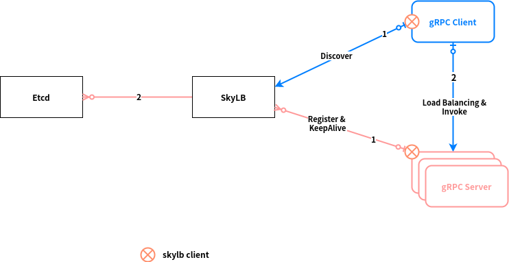

# grpc-skylb

`gRPC SkyLB`: an external gRPC load balancer based on [External Load Balancing Service](https://github.com/grpc/grpc/blob/master/doc/load-balancing.md#external-load-balancing-service). Implemented in the Java language. The design follows the gRPC Load Balancer Architecture (https://github.com/grpc/grpc/blob/master/doc/load-balancing.md)

## Overview

Different from traditional RPC systerm. gRPC is based on HTTP2 thus the recommended way to call an RPC is to create one long lived connect and use it for all clients (multiplexing and streaming).

It has the benefit of very high efficiency and throughput. However, it gives the traditional load balance architecture a difficulty to fit in. These architectures works nicely for ephemeral connections, but failed badly in gRPC.

To fix this issue, a load balancing architecture proposal was created by the gRPC dev team in Febrary, 2016 and reached its maturity around July, 2016. We are copied [load-balancing.md](https://github.com/grpc/grpc/blob/master/doc/load-balancing.md) and cached the proposal. The core module in this proposal is an [external load balancer](https://github.com/grpc/grpc/blob/master/doc/load-balancing.md#external-load-balancing-service) which aims at both flexibility and the simplicity for the gRPC client programming.

However, there is not an official implementation for the external load balancer (and probably there will not be an official one since every company has its distinct production environment). This is the reason we initiated the project `gRPC-SkyLB`.

## Architecture of SkyLB

The design follows the gRPC "Load Balancer Architecture" [workflow](https://github.com/grpc/grpc/blob/master/doc/load-balancing.md#workflow)

As shown in the diagram, we will go into the implementation details below:

- All service info is saved in an etcd cluster
- One or more `SkyLB` servers talk to the etcd cluster
- `SkyLB` service is highly available (more than one instances). Its load is rather light and stable
- At the first step, both the gRPC clients and services ask `SkyLB` to resolve the location of `SkyLB` instances. One `SkyLB` instance will be randomly chosen
- Target instance perspective
  - After a `SkyLB` instance is chosen, the target service sends a gRPC call to `SkyLB` with a *streaming request*
  - The request is treated as a heartbeat or load report. With a fixed interval, the target service keeps sending requests to `SkyLB`
  - `SkyLB` finds the remote address of the target instance, and saves it with other info (priority and weight) to etcd with a TTL
- Client instance perspective
  - After a `SkyLB` instance is chosen, the gRPC client sends a gRPC call (with the target service name) to `SkyLB`, and receives a *streaming response*
  - `SkyLB` should return a response right after the request arrives, and whenever the service changes
  - The response contains all services currently alive by the knowledge of `SkyLB`
  - The client establishes a gRPC connection to all target instances. When the client is notified for service change, it update the connections
  - For each gRPC call, the client instance chooses one connection to send requests. We can use the built-in `RoundRobin` or `ConsistentHash` policy to choose connection. In future we might have more complex load balancing policies

## Diagnostic Protocol

After a client connects to the `SkyLB` server, it starts a two-way gRPC stream call. The client then comes into a passive mode, waiting for instruction from the server. When the time comes (for example when user triggers it through UI), the server sends a specific request to the client, and the client executes the instruction and returns with a corresponding response.

> *NOTE* 
>
> that whenever an error is caused during the streaming talk, the stream has to be discarded and a new stream should be created (by the client).

The API protocol is defined in [github.com/binchencoder/grpc-skylb/skylb-proto/api.proto](https://github.com/binchencoder/grpc-skylb/tree/master/skylb-proto).

## Examples

### Server

https://github.com/binchencoder/grpc-skylb/blob/master/examples/echo/src/main/java/com/binchencoder/skylb/examples/echo/server/EchoServer.java

### Client

https://github.com/binchencoder/grpc-skylb/blob/master/examples/echo/src/main/java/com/binchencoder/skylb/examples/echo/client/EchoClient.java